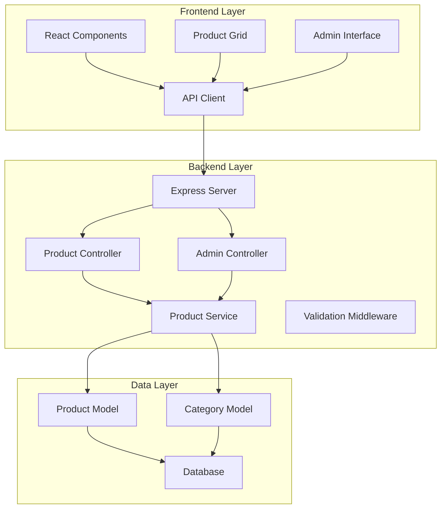

# Design Document: E-commerce Product System

## Overview

This design implements a comprehensive e-commerce product system that replaces static/mock data with a proper database-backed solution. The system features a React/TypeScript frontend consuming data from a Node.js/Express backend with database integration, balanced grid layouts, and admin management capabilities.

The architecture follows a three-tier pattern: presentation layer (React frontend), application layer (Express API), and data layer (database with ORM). The design emphasizes performance, scalability, and maintainability while addressing the core issues of inappropriate products, unbalanced layouts, and static data usage.

## Architecture

### System Architecture



### Technology Stack

**Frontend:**
- React 18+ with TypeScript
- CSS Grid/Flexbox for responsive layouts
- Axios for API communication
- React Query for data fetching and caching

**Backend:**
- Node.js with Express framework
- TypeScript for type safety
- Prisma ORM for database operations
- Express-validator for input validation
- Multer for image upload handling

**Database:**
- PostgreSQL for production reliability
- Structured schema with proper indexing
- Foreign key constraints for data integrity

## Components and Interfaces

### Frontend Components

**ProductGrid Component:**
```typescript
interface ProductGridProps {
  products: Product[];
  loading: boolean;
  error?: string;
  columns?: number;
}

interface Product {
  id: string;
  name: string;
  description: string;
  price: number;
  category: string;
  imageUrl: string;
  inStock: boolean;
  createdAt: Date;
}
```

**AdminProductManager Component:**
```typescript
interface AdminProductManagerProps {
  onProductCreate: (product: CreateProductRequest) => Promise<void>;
  onProductUpdate: (id: string, product: UpdateProductRequest) => Promise<void>;
  onProductDelete: (id: string) => Promise<void>;
}

interface CreateProductRequest {
  name: string;
  description: string;
  price: number;
  categoryId: string;
  imageUrl: string;
  inStock: boolean;
}
```

### Backend API Interfaces

**Product Controller:**
```typescript
interface ProductController {
  getProducts(req: GetProductsRequest, res: Response): Promise<void>;
  getProductById(req: GetProductByIdRequest, res: Response): Promise<void>;
  createProduct(req: CreateProductRequest, res: Response): Promise<void>;
  updateProduct(req: UpdateProductRequest, res: Response): Promise<void>;
  deleteProduct(req: DeleteProductRequest, res: Response): Promise<void>;
}

interface GetProductsRequest extends Request {
  query: {
    page?: string;
    limit?: string;
    category?: string;
    minPrice?: string;
    maxPrice?: string;
    search?: string;
    inStock?: string;
  };
}
```

**Product Service:**
```typescript
interface ProductService {
  findProducts(filters: ProductFilters): Promise<PaginatedProducts>;
  findProductById(id: string): Promise<Product | null>;
  createProduct(data: CreateProductData): Promise<Product>;
  updateProduct(id: string, data: UpdateProductData): Promise<Product>;
  deleteProduct(id: string): Promise<void>;
  validateProductData(data: ProductData): ValidationResult;
}

interface ProductFilters {
  page: number;
  limit: number;
  category?: string;
  minPrice?: number;
  maxPrice?: number;
  search?: string;
  inStock?: boolean;
}
```

### API Endpoints

**Product Management:**
- `GET /api/products` - List products with filtering and pagination
- `GET /api/products/:id` - Get single product details
- `POST /api/products` - Create new product (admin only)
- `PUT /api/products/:id` - Update product (admin only)
- `DELETE /api/products/:id` - Delete product (admin only)

**Category Management:**
- `GET /api/categories` - List all product categories
- `POST /api/categories` - Create new category (admin only)

**Bulk Operations:**
- `POST /api/products/bulk` - Bulk import products (admin only)

## Data Models

### Database Schema

**Products Table:**
```sql
CREATE TABLE products (
  id UUID PRIMARY KEY DEFAULT gen_random_uuid(),
  name VARCHAR(255) NOT NULL,
  description TEXT,
  price DECIMAL(10,2) NOT NULL CHECK (price > 0),
  category_id UUID NOT NULL REFERENCES categories(id),
  image_url VARCHAR(500),
  in_stock BOOLEAN DEFAULT true,
  created_at TIMESTAMP DEFAULT CURRENT_TIMESTAMP,
  updated_at TIMESTAMP DEFAULT CURRENT_TIMESTAMP
);

CREATE INDEX idx_products_category ON products(category_id);
CREATE INDEX idx_products_price ON products(price);
CREATE INDEX idx_products_in_stock ON products(in_stock);
CREATE INDEX idx_products_name_search ON products USING gin(to_tsvector('english', name));
```

**Categories Table:**
```sql
CREATE TABLE categories (
  id UUID PRIMARY KEY DEFAULT gen_random_uuid(),
  name VARCHAR(100) NOT NULL UNIQUE,
  description TEXT,
  created_at TIMESTAMP DEFAULT CURRENT_TIMESTAMP
);
```

### Prisma Schema

```prisma
model Product {
  id          String   @id @default(uuid())
  name        String
  description String?
  price       Decimal  @db.Decimal(10, 2)
  categoryId  String   @map("category_id")
  imageUrl    String?  @map("image_url")
  inStock     Boolean  @default(true) @map("in_stock")
  createdAt   DateTime @default(now()) @map("created_at")
  updatedAt   DateTime @updatedAt @map("updated_at")
  
  category    Category @relation(fields: [categoryId], references: [id])
  
  @@index([categoryId])
  @@index([price])
  @@index([inStock])
  @@map("products")
}

model Category {
  id          String    @id @default(uuid())
  name        String    @unique
  description String?
  createdAt   DateTime  @default(now()) @map("created_at")
  
  products    Product[]
  
  @@map("categories")
}
```

### Grid Layout Algorithm

**Balanced Distribution Logic:**
```typescript
interface GridBalancer {
  distributeProducts(products: Product[], columns: number): Product[][];
  calculateOptimalColumns(containerWidth: number, minItemWidth: number): number;
  rebalanceOnResize(currentGrid: Product[][], newColumns: number): Product[][];
}

// Implementation ensures even distribution across columns
function distributeProducts(products: Product[], columns: number): Product[][] {
  const grid: Product[][] = Array(columns).fill(null).map(() => []);
  
  products.forEach((product, index) => {
    const columnIndex = index % columns;
    grid[columnIndex].push(product);
  });
  
  return grid;
}
```

## Correctness Properties

*A property is a characteristic or behavior that should hold true across all valid executions of a system—essentially, a formal statement about what the system should do. Properties serve as the bridge between human-readable specifications and machine-verifiable correctness guarantees.*

### Property 1: Product Catalog Category Diversity
*For any* product catalog with 5 or more products, the catalog should contain products from at least 5 distinct categories
**Validates: Requirements 1.2**

### Property 2: Product Entity Completeness
*For any* Product_Entity in the system, it should contain all required fields (name, description, price, category, imageUrl, inStock) with proper data types
**Validates: Requirements 1.3**

### Property 3: Currency Formatting Consistency
*For any* price value in the system, when formatted for display, it should follow proper currency formatting rules (positive decimal with appropriate currency symbol)
**Validates: Requirements 1.4**

### Property 4: RESTful API Compliance
*For any* product API endpoint, it should follow REST conventions with proper HTTP methods, status codes, and response structures
**Validates: Requirements 2.1**

### Property 5: Database-Driven Data Source
*For any* API response containing product data, the data should originate from database queries rather than static files or hardcoded values
**Validates: Requirements 2.2**

### Property 6: Database Schema Compliance
*For any* product stored in the database, it should conform to the defined schema structure with all required fields and constraints
**Validates: Requirements 2.3**

### Property 7: Comprehensive Data Integrity
*For any* product data operation (create, update, delete), the system should enforce all validation rules including positive prices, unique identifiers, referential integrity, and proper error logging for invalid data
**Validates: Requirements 6.1, 6.2, 6.4, 6.5, 6.6**

### Property 8: Graceful Error Handling
*For any* system error (database connection failure, API error), the system should handle it gracefully with appropriate HTTP status codes and user-friendly error messages
**Validates: Requirements 2.5, 7.2**

### Property 9: Balanced Grid Distribution
*For any* set of products and grid column count, the products should be distributed evenly across columns with no column remaining empty while others are full
**Validates: Requirements 3.1, 3.2**

### Property 10: Responsive Grid Adaptation
*For any* viewport size change, the product grid should rebalance appropriately and maintain minimum column requirements (3 for desktop, 1 for mobile)
**Validates: Requirements 3.4, 3.5**

### Property 11: Admin CRUD Operations
*For any* valid product data, admin operations (create, update, delete) should work correctly with proper validation, confirmation, and immediate reflection in the customer catalog
**Validates: Requirements 4.1, 4.2, 4.3, 4.6**

### Property 12: Input Validation Enforcement
*For any* product management operation, the system should validate all required fields and reject invalid data before saving
**Validates: Requirements 4.4**

### Property 13: Bulk Import Functionality
*For any* collection of valid product data, bulk import should successfully add all products while handling individual errors appropriately
**Validates: Requirements 4.5**

### Property 14: Pagination Correctness
*For any* product listing request with pagination parameters, the API should return the correct subset of products with accurate page boundaries and total counts
**Validates: Requirements 5.1**

### Property 15: Filtering and Search Accuracy
*For any* product filtering or search query, the API should return only products that match the specified criteria (category, price range, availability, search terms)
**Validates: Requirements 5.2, 5.3**

### Property 16: Caching Effectiveness
*For any* frequently requested product data, the caching system should improve response times while maintaining data freshness
**Validates: Requirements 5.5**

### Property 17: URL Validation
*For any* product image URL, the system should validate URL format and structure before accepting it
**Validates: Requirements 6.3**

### Property 18: Frontend API Integration
*For any* frontend component requiring product data, it should consume data exclusively through backend API endpoints with proper data validation
**Validates: Requirements 7.1, 7.4**

### Property 19: Loading State Management
*For any* API request from the frontend, the system should properly manage loading states and implement retry logic for failed requests
**Validates: Requirements 7.3, 7.5**

### Property 20: Image Fallback Handling
*For any* product with missing or invalid image data, the frontend should display appropriate fallback placeholders
**Validates: Requirements 7.6**

## Error Handling

### Database Connection Errors
- Implement connection pooling with retry logic
- Graceful degradation when database is unavailable
- Proper logging of connection issues
- Health check endpoints for monitoring

### API Error Responses
- Standardized error response format with error codes
- Appropriate HTTP status codes for different error types
- User-friendly error messages for frontend consumption
- Rate limiting and abuse prevention

### Data Validation Errors
- Field-level validation with specific error messages
- Bulk operation error handling with partial success reporting
- Image URL validation with accessibility checking
- Price and numeric field validation

### Frontend Error Handling
- Global error boundary for React components
- API error state management with user notifications
- Retry mechanisms for transient failures
- Offline state handling and data synchronization

## Testing Strategy

### Dual Testing Approach
The system requires both unit testing and property-based testing for comprehensive coverage:

**Unit Tests:**
- Specific examples demonstrating correct behavior
- Edge cases and error conditions
- Integration points between components
- API endpoint functionality with mock data

**Property Tests:**
- Universal properties across all inputs using randomized data
- Comprehensive input coverage through generators
- Validation of business rules and constraints
- Performance characteristics under various loads

### Property-Based Testing Configuration
- **Framework:** Use fast-check for TypeScript/JavaScript property testing
- **Iterations:** Minimum 100 iterations per property test
- **Tagging:** Each property test tagged with format: **Feature: ecommerce-product-system, Property {number}: {property_text}**
- **Coverage:** Each correctness property implemented by a single property-based test

### Unit Testing Balance
- Focus unit tests on specific examples, integration points, and edge cases
- Avoid excessive unit tests since property tests handle comprehensive input coverage
- Emphasize testing of:
  - Database connection and schema validation
  - API endpoint integration
  - React component rendering with various props
  - Error boundary behavior
  - Image loading and fallback mechanisms

### Test Data Management
- Seed database with realistic product data for testing
- Generate random but valid product data for property tests
- Mock external services (image URLs, payment processing)
- Clean test data between test runs to ensure isolation